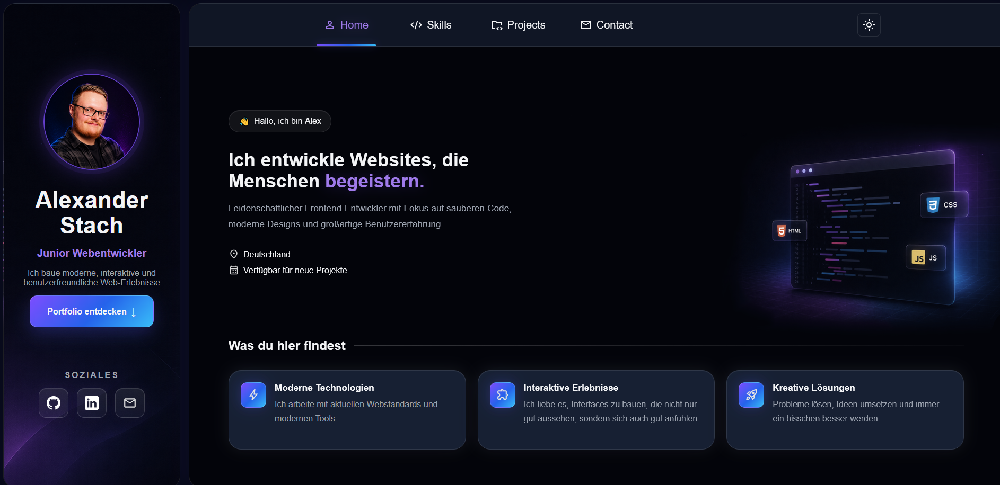
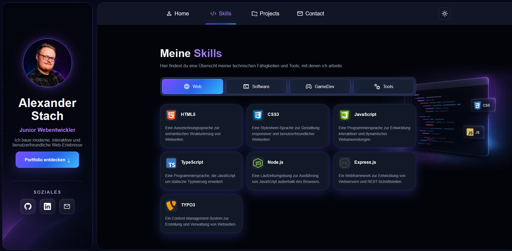
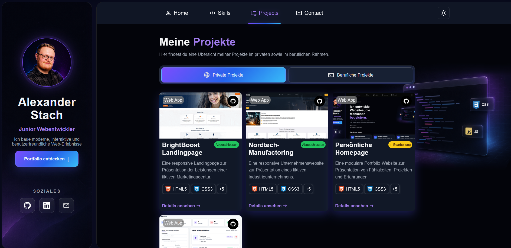
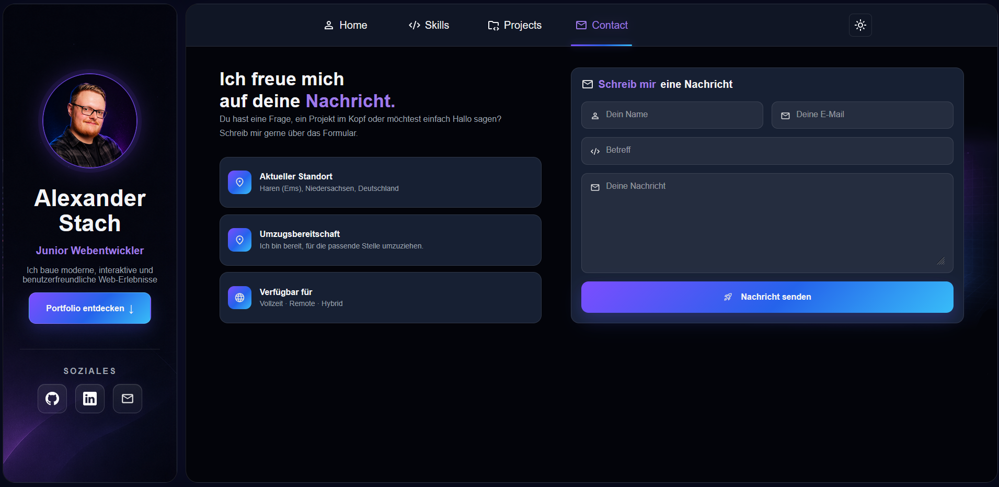
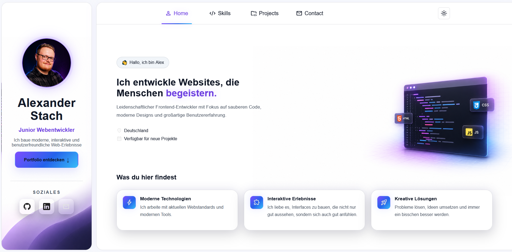
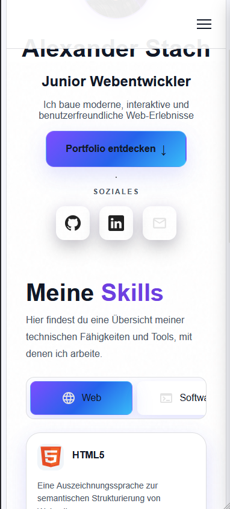

# Personal Homepage

Die **Personal Homepage** ist die persönliche Portfolio-Website von Alexander Stach. Sie präsentiert den beruflichen Schwerpunkt als Frontend- und Softwareentwickler und gibt einen kompakten Überblick über Projekte, Fähigkeiten und Kontaktmöglichkeiten.

## Zweck

Die Website dient als zentrale digitale Visitenkarte und Portfolio. Interessierte können sich über bisherige private und berufliche Projekte, eingesetzte Technologien sowie den persönlichen Werdegang informieren und direkt Kontakt aufnehmen.

## Highlights

- Moderne, responsive Portfolio-Oberfläche für Desktop und mobile Geräte
- Übersichtliche Bereiche für Startseite, Projekte, Skills und Kontakt
- Dynamische Darstellung von Projekten und Technologien
- Projekt- und Skill-Details in interaktiven Modalfenstern
- Screenshot-Karussell für Projektansichten
- Kategorien und Tabs zur schnellen Filterung der Inhalte
- Kontaktformular mit clientseitiger Validierung
- SEO-Grundlagen mit Meta-Tags, Open Graph, Sitemap und `robots.txt`
- Deployment als statische Website, unter anderem für GitHub Pages geeignet

## Technologien

- **HTML5** für die semantische Struktur der Seiten
- **CSS3** für Layout, responsive Design, Komponenten und Animationen
- **JavaScript (ES Modules)** für Navigation, Datenverarbeitung und Interaktionen
- **JSON** als Datenbasis für Projekte, Skills und weitere Inhalte
- **Node.js** als vorbereitete Backend-Struktur
- **GitHub Pages** für die Veröffentlichung der statischen Website

## Projektstruktur

```text
├── assets/      Bilder, Screenshots und Icons
├── backend/     Backend-Struktur
├── css/         Globale, komponenten- und seitenspezifische Styles
├── data/        JSON-Daten für Projekte und Inhalte
├── html/        Wiederverwendbare HTML-Komponenten
├── js/          Module, Komponenten und Seitenskripte
├── *.html       Die einzelnen Seiten der Website
└── README.md    Projektdokumentation
```

## Screenshots











